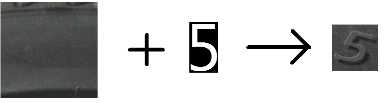
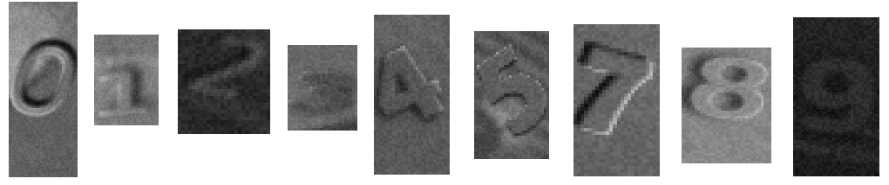
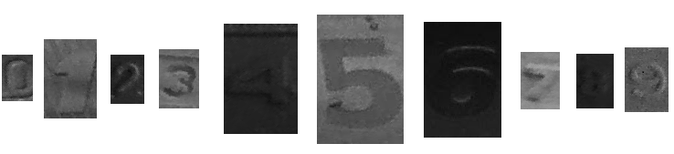
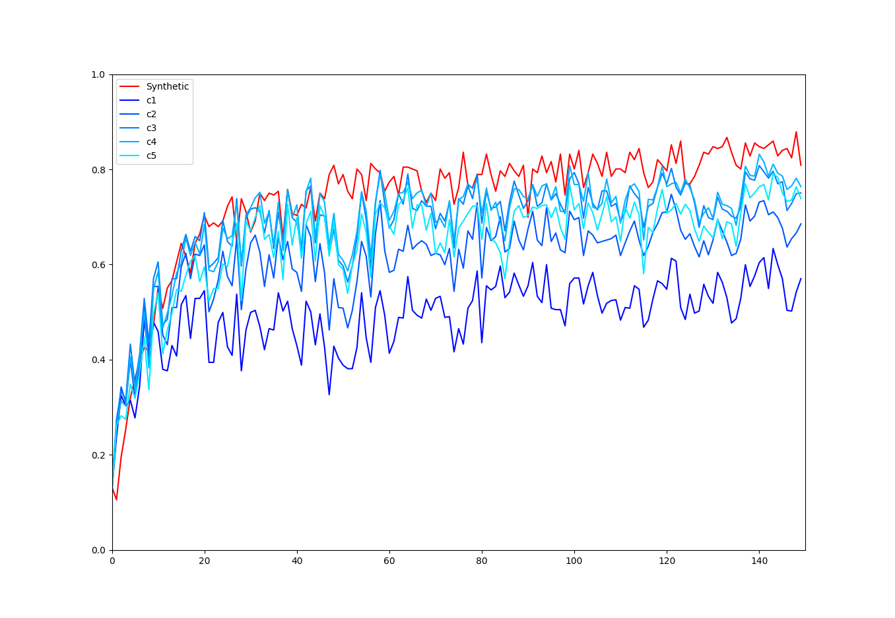

# Tyre DOT digits classification using synthetic data generator

The project is a continuation of the engineering thesis. The goal was to recognize wheel parameters. The distribution of data in the prepared image database was uneven, so the first approach was to train a neural network using a synthetic data generator following the idea from this publication (https://core.ac.uk/download/pdf/286712293.pdf). Then this approach failed and real images were used to achieve adequate results. In this project, I explore the possibility of using artificially generated data to train neural networks to recognize tyre markings. To get started, the problem has been simplified to digit classification.

## Dataset

Dataset is divided into training and test sets.

### Training dataset

Training data is generated on the fly during the trainig process. 
The image of the digit is combined with the background. 
Color is adjusted, shadow and glow are added. Noise is applied. 
The image of the digit and the final image are scaled down and up to degrade quality.

### Test dataset

The dataset is divided into 6 parts. 
The first part is data generated on the fly as a reference. 
The other 5 parts are the actual images of tire digits.
Each part contains the same 677 images images, but cropped differently. 
The quality of the photos varies, but in most cases they are 
of poor quality and low contrast.

## Used tools
- PyTorch
- Python Imaging Library (PIL)
- numpy
- Matplotlib

## Results

The Resnet18 was used. Images were rescaled to 50x75 pix. Best achieved accuracy on test dataset is 83%.

